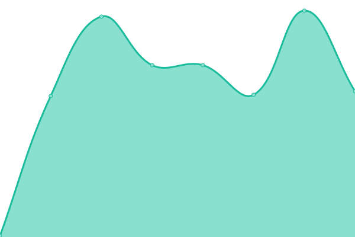
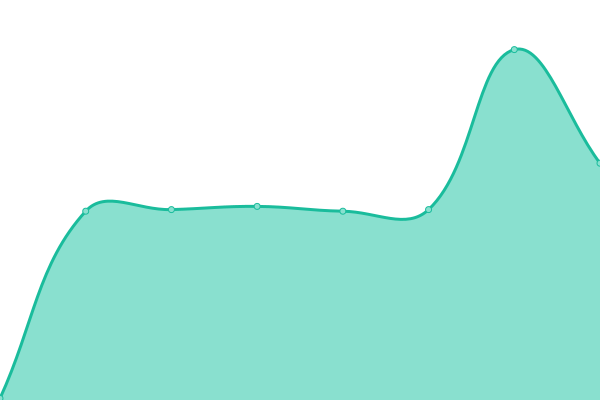

# [📈 Live Status](https://PauloGoncalvesBH.github.io/serverest-status-uptime): <!--live status--> **🟩 All systems operational**

This repository contains the open-source uptime monitor and status page for [Paulo Gonçalves](https://PauloGoncalvesBH.github.io/serverest-status-uptime), powered by [Upptime](https://github.com/upptime/upptime).

With [Upptime](https://upptime.js.org), you can get your own unlimited and free uptime monitor and status page, powered entirely by a GitHub repository. We use [Issues](https://github.com/PauloGoncalvesBH/serverest-status-uptime/issues) as incident reports, [Actions](https://github.com/PauloGoncalvesBH/serverest-status-uptime/actions) as uptime monitors, and [Pages](https://PauloGoncalvesBH.github.io/serverest-status-uptime) for the status page.

<!--start: status pages-->
<!-- This summary is generated by Upptime (https://github.com/upptime/upptime) -->
<!-- Do not edit this manually, your changes will be overwritten -->
<!-- prettier-ignore -->
| URL | Status | History | Response Time | Uptime |
| --- | ------ | ------- | ------------- | ------ |
|  [ServeRest.dev](http://serverest.dev/) | 🟩 Up | [serve-rest-dev.yml](https://github.com/ServeRest/status/commits/HEAD/history/serve-rest-dev.yml) | 

 985ms
     
 | 

<a href="https://status.serverest.dev/history/serve-rest-dev">100.00%</a>
    

|  [API /usuarios](http://serverest.dev/usuarios) | 🟩 Up | [api-usuarios.yml](https://github.com/ServeRest/status/commits/HEAD/history/api-usuarios.yml) | 

 142ms
     
 | 

<a href="https://status.serverest.dev/history/api-usuarios">100.00%</a>
    

|  [API /carrinhos](http://serverest.dev/carrinhos) | 🟩 Up | [api-carrinhos.yml](https://github.com/ServeRest/status/commits/HEAD/history/api-carrinhos.yml) | 

 142ms
     
 | 

<a href="https://status.serverest.dev/history/api-carrinhos">100.00%</a>
    

|  [API /produtos](http://serverest.dev/produtos) | 🟩 Up | [api-produtos.yml](https://github.com/ServeRest/status/commits/HEAD/history/api-produtos.yml) | 

 144ms
     
 | 

<a href="https://status.serverest.dev/history/api-produtos">100.00%</a>
    

<!--end: status pages-->

[**Visit our status website →**](https://PauloGoncalvesBH.github.io/serverest-status-uptime)

## 📄 License

- Powered by: [Upptime](https://github.com/upptime/upptime)
- Code: [MIT](./LICENSE) © [Paulo Gonçalves](https://PauloGoncalvesBH.github.io/serverest-status-uptime)
- Data in the `./history` directory: [Open Database License](https://opendatacommons.org/licenses/odbl/1-0/)
